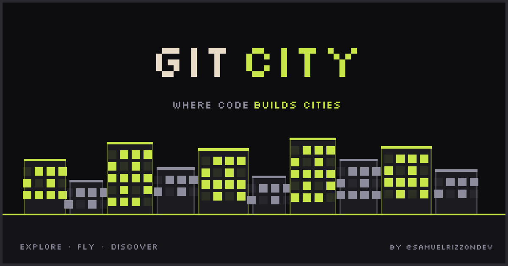

<h1 align="center">DevX GitHub City</h1>

<p align="center">
  <strong>Your GitHub profile as a 3D pixel art building in an interactive city.</strong>
</p>

<p align="center">
  Built by <strong>Gurbaaz Singh</strong>, President of <strong>DevX GTBIT</strong>
</p>

<p align="center">
  
</p>

---

## What is DevX GitHub City?

DevX GitHub City transforms every GitHub profile into a unique pixel art building. The more you contribute, the taller your building grows. Explore an interactive 3D city, fly between buildings, and discover developers from around the world.

## Features

- **3D Pixel Art Buildings** — Each GitHub user becomes a building with height based on contributions, width based on repos, and lit windows representing activity
- **Free Flight Mode** — Fly through the city with smooth camera controls, visit any building, and explore the skyline
- **Profile Pages** — Dedicated pages for each developer with stats, achievements, and top repositories
- **Achievement System** — Unlock achievements based on contributions, stars, repos, referrals, and more
- **Building Customization** — Claim your building and customize it with items from the shop (crowns, auras, roof effects, face decorations)
- **Social Features** — Send kudos, gift items to other developers, refer friends, and see a live activity feed
- **Compare Mode** — Put two developers side by side and compare their buildings and stats
- **Share Cards** — Download shareable image cards of your profile in landscape or stories format

## How Buildings Work

| Metric         | Affects           | Example                                |
|----------------|-------------------|----------------------------------------|
| Contributions  | Building height   | 1,000 commits → taller building        |
| Public repos   | Building width    | More repos → wider base                |
| Stars          | Window brightness | More stars → more lit windows           |
| Activity       | Window pattern    | Recent activity → distinct glow pattern |

Buildings are rendered with instanced meshes and a LOD (Level of Detail) system for performance. Close buildings show full detail with animated windows; distant buildings use simplified geometry.

## Tech Stack

- **Framework:** [Next.js](https://nextjs.org) 16 (App Router, Turbopack)
- **3D Engine:** [Three.js](https://threejs.org) via [@react-three/fiber](https://github.com/pmndrs/react-three-fiber) + [drei](https://github.com/pmndrs/drei)
- **Database & Auth:** [Supabase](https://supabase.com) (PostgreSQL, GitHub OAuth, Row Level Security)
- **Payments:** [Stripe](https://stripe.com)
- **Styling:** [Tailwind CSS](https://tailwindcss.com) v4 with pixel font (Silkscreen)
- **Hosting:** [Vercel](https://vercel.com)

## Getting Started

```bash
# Clone the repo
git clone https://github.com/gurbaazsingh411-hub/devx-code-city.git
cd devx-code-city

# Install dependencies
npm install

# Set up environment variables
cp .env.example .env.local
# Fill in Supabase and Stripe keys

# Run the dev server
npm run dev
```

Open [http://localhost:3001](http://localhost:3001) to see the city.

## License

[AGPL-3.0](LICENSE) — You can use and modify DevX GitHub City, but any public deployment must share the source code.

---

<p align="center">
  Built by <a href="https://github.com/gurbaazsingh411-hub">Gurbaaz Singh</a> — President of <a href="https://devx-code-city.netlify.app">DevX GTBIT</a>
</p>
